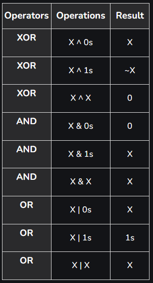

# Bit Manipulation
- Involves operating on individual bits within a piece of data, typically an integer or sequence of bits.



Time Complexity: O(1).<br>
Auxillary Space: O(1).

```
XOR: a ^ b
AND: a & b
OR: a | b
NOT: ~ (or !)
LEFT SHIFT: <<
RIGHT SHIFT: >>

# Some basic functions
def getBit(num, index):
    return ((num & (1 << i)) != 0)  # Returns True (1) or False (0)

def setBit(num, i):
    return num | (1 << i)

def clearBit(num, i):
    mask = ~(1 << i)
    return num & mask

# Checking LSB = 1
if c & 1: Do something

# Iterating (in python)
c = a ^ b           # c = a XOR b
while c:
    if c & 1:       # If LSB = 1 (as an example)
        Do something
    c >>= 1         # Shift right to check next LSB
``` 