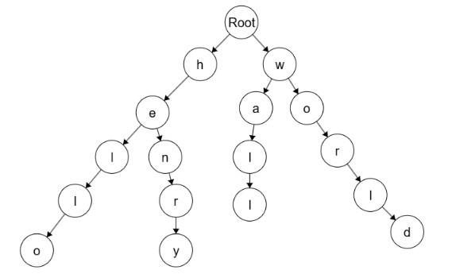

# Trie
### Functionality:
- Specialised tree structure
- Used to store a set of keys represented as strings
- Each node is a single digit or character of a larger string
    - Each node represents a character or a part of a string
- Root acts as a starting point and does not contain any character
- For example, in "hello" we have nodes "h" -> "e" -> "l" -> "l" -> "o"
- Allows efficient retrieval and storage of keys
- Supports insertion, search, deletion, and prefix searches

### Examples
Say we insert hello, world, henry, wall
We would get the following Trie structure:

### Big-O:
Insertion: 
    Time Complexity is O(n) because for an n-character string, we insert each character one at a time.
    Space Complexity is O(n) because a new insert will use at most n new nodes to store the word.

Deletion [https://www.youtube.com/watch?v=XK8MD9N9WUA]:
    Deletion is a bit more complicated as the word we wish to delete may branch off into other words.
    From our example before, if we remove henry we dont want to remove "he" from hello.
    We delete nodes recursively from the "bottom up" to avoid damaging other nodes.
    At each node, check if it is marked as the end of a word to avoid deleting prefix words.
    Recursively delete nodes with no children that are not of a prefix until reaching the root.

    Time Complexity is always O(n) because we have to check all n-character nodes.
    Using iterative deletion, Space Complexity is O(1) because we only check the current node.
    Using recursive deletion, Space Complexity is O(n) due to the recursive call stack

Searching: 
    Time Complexity is O(n) because we have to check every character exists in the n-character word.
    Space Complexity is O(1) because we only have to track the current character in the string.

Prefix Searching: 
    Same Time and Space complexity as Searching for the same reason